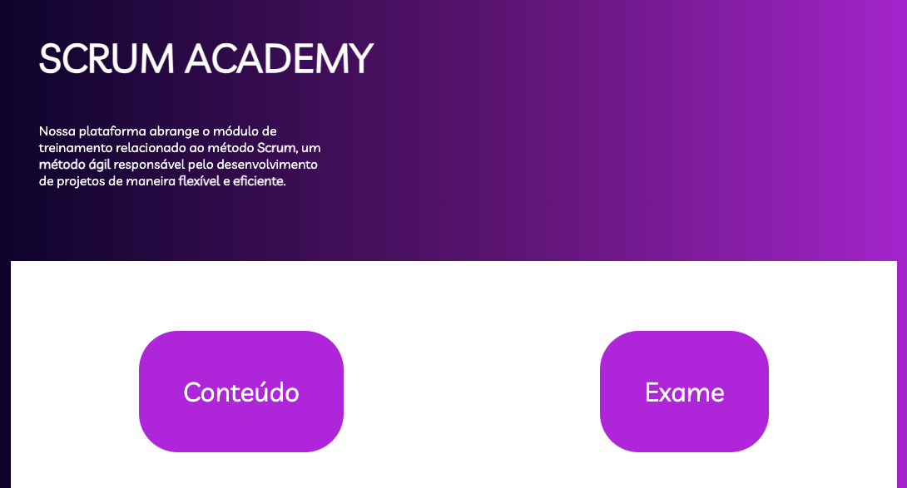
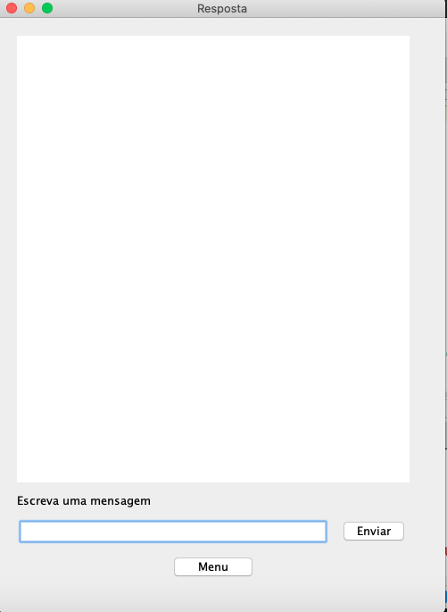
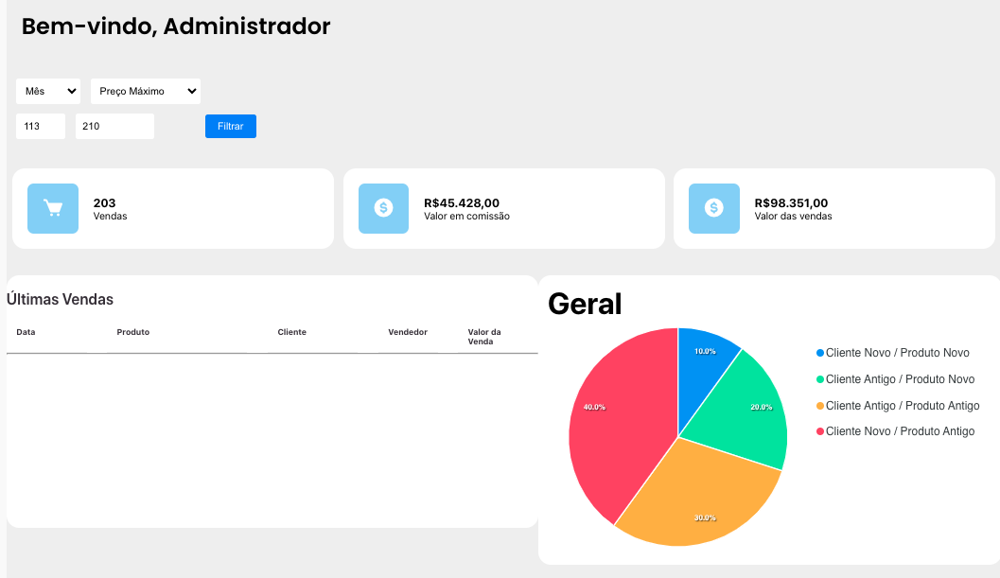
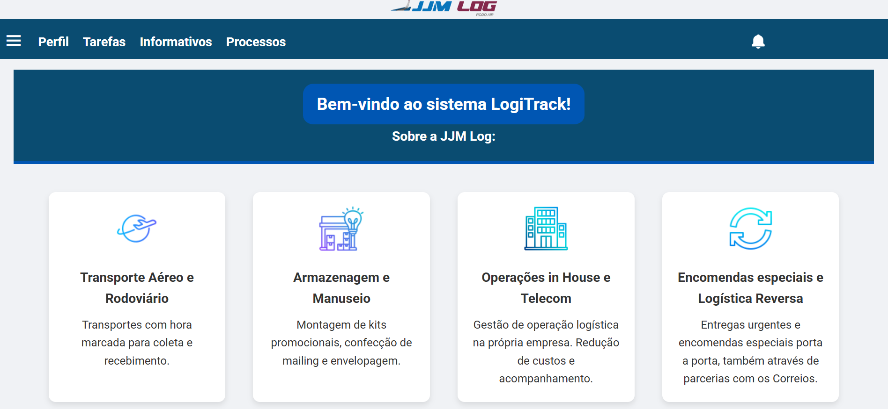
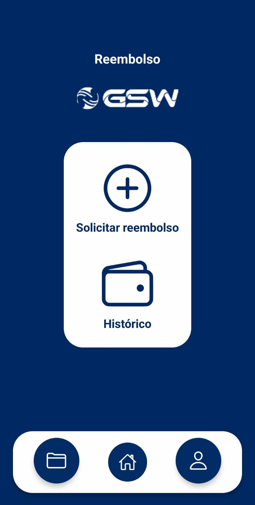
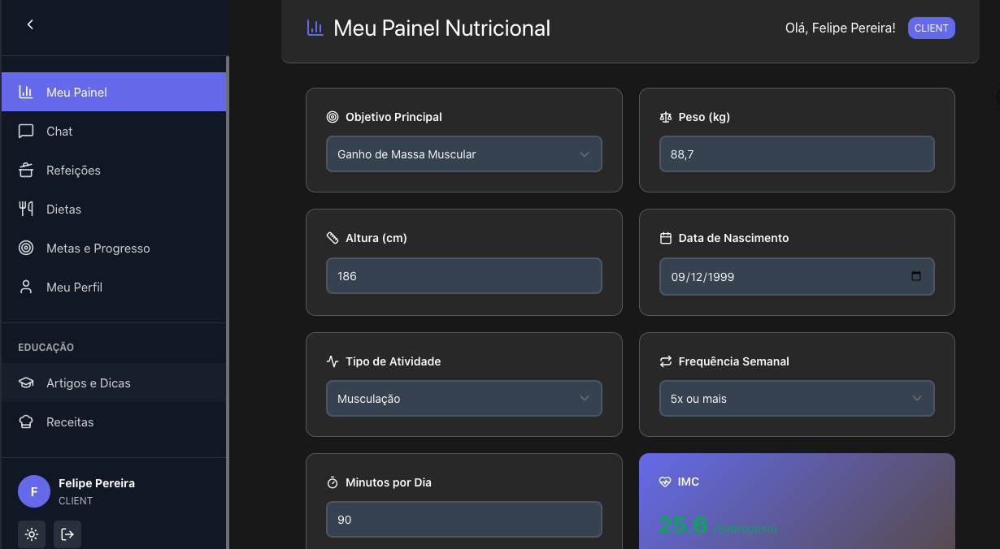

# Kalil Alves Pereira
 

<h2 align='center'> Introdução </h2>
   
  

  Bem-vindo! Me chamo Kalil, e tenho 20 anos.

Atualmente, sou estudante do 6º semestre do curso de Análise e Desenvolvimento de Sistemas na Fatec Prof. Jessen Vidal, em São José dos Campos. Desde criança sempre tive interesse por tecnologia e uma grande curiosidade por todo o funcionamento por trás da mesma.

Desde muito jovem, sempre tive uma forte inclinação por áreas relacionadas a software e tecnologia. Meu primeiro contato real com programação aconteceu durante o período da pandemia, momento em que tive a oportunidade de explorar esse universo com mais profundidade. A convivência com pessoas já inseridas no mercado de tecnologia foi fundamental para despertar ainda mais meu interesse, oferecendo orientações valiosas e ampliando minha visão sobre a área. Naturalmente, decidi seguir esse caminho profissional e, como parte desse processo, prestei vestibular para o curso de Análise e Desenvolvimento de Sistemas na FATEC de São José dos Campos — onde iniciei minha formação acadêmica e mergulhei de vez no mundo da programação e do desenvolvimento de software.

No segmento do desenvolvimento de software, tenho buscado aprimorar continuamente minhas competências principalmente no front-end em primeiro lugar, dominando bibliotecas como o React, e linguagens como o Typescript, e em segundo lugar bancos de dados, exibindo proficiência em linguagens como MySQL, Postgres SQL, e MongoDB. Sem dispensar as soft skills, como organização, resolução de problemas, entrega de resultados, e trabalho em equipe, as desenvolvi extensivamente com projetos acadêmicos feitos ao decorrer dos semestre do meu curso utilizando metodologias ágeis como Scrum e Kanban, me proporcionando experiência prática como Scrum Master e como Desenvolvedor (Scrum Team).

Atualmente, estou buscando minha primeira experiência formal no mercado de tecnologia. É fato que tenho muito para oferecer e contribuir, e muito o que aprender também. Sigo procurando evoluir constantemente como profissional e como pessoa, e não pretendo parar tão cedo.

   

 

  

<h2 align='center'> Contatos </h2>

 

 

<h2 align='center'>Meus Principais Conhecimentos </h2>

 

## Projetos

### Em 2023-1 - Scrum Academy - (1° Semestre)

O projeto do primeiro semestre teve como empresa parceira, a FATEC de São José dos Campos. Os requisitos foram passados pelo professor Antônio Egydio, que assumiu o papel de cliente final.

O problema apresentado foi dificuldade de entendimento dos alunos da FATEC, no que se diz respeito à metodologia Scrum, principalmente pela falta de exemplos práticos. 

Como solução foi desenvolvido uma aplicação web que ensine a metodologia scrum de maneira intuitiva, com vídeos e exemplos práticos.

> Acesse o repositório desse projeto clicando <a href="https://github.com/Sandro-Pimentel/AReS" target="_blank">aqui!</a>

### ⚒️ Tecnologias Utilizadas

- HTML - Linguagem de marcação para estruturar a aplicação;
- CSS - Linguagem de marcação para estilizar o aplicação;
- Python - Linguagem de programação utilizada no back-end;
- Flask - Framework baseado em python para trabalhar com Python para web, utilizado para o roteamento das páginas do front-end;
- Javascript - Linguagem de programação utilizada no front-end.

 

<h1></h1>

### 💡Contribuições Pessoais

Neste projeto, atuei ativamente na implementação do framework Flask, sendo responsável pelo desenvolvimento do roteamento das páginas web, garantindo uma navegação fluida e estruturada na plataforma. Além disso, contribuí diretamente na produção e curadoria de conteúdo educacional para diversos capítulos, incluindo a elaboração de textos explicativos, inserção de vídeos e disponibilização de materiais complementares para download, como modelos de burndown chart e backlog. Essas ações tiveram como objetivo enriquecer a experiência do usuário e oferecer recursos práticos para aplicação dos conceitos abordados.

 

<b>Hard Skills</b>

- HTML - Uso com autonomia;
- CSS - Uso com autonomia;
- Python - Uso com autonomia;
- Javascript - Uso com auxílio.

 

<b>Soft Skills</b>

Durante o projeto, desenvolvi habilidades como orientação a resultados e resiliência. Como a programação na prática ainda era algo novo para mim, e um dos membros da equipe havia desistido do curso no meio do semestre, precisei dedicar muito tempo às tarefas — algo que também aconteceu com os demais integrantes. No entanto, com um bom nível de persistência, minha equipe e eu conseguimos entregar tudo dentro dos prazos.

 

### Em 2023-2 - Lotus Chatbot - (2° Semestre)

O projeto do segundo semestre teve como empresa parceira, a FATEC de São José dos Campos. Os requisitos foram passados pelo professor Giuliano Bertoti, que atuou como cliente final. 

O problema apresentado foi a dificuldade dos usuários na análise de documentos longos ou técnicos, especialmente na extração de informações relevantes, o que impactava diretamente a produtividade em estudos, pesquisas e processos de tomada de decisão. 

Como solução, foi desenvolvido um sistema baseado em inteligência artificial capaz de interpretar automaticamente documentos e gerar perguntas e respostas contextualizadas, mantendo a coerência com o conteúdo e proporcionando uma análise mais rápida, dinâmica e eficiente.

> Acesse o repositório desse projeto clicando <a href="https://github.com/VituuSaborito/Lotus" target="_blank">aqui!</a>

### ⚒️ Tecnologias Utilizadas

- Java - Linguagem de programação utilizada para implementação da lógica e criação da interface gráfica;
- Eclipse - IDE utilizada para desenvolvimento e compilação de código;
- MySQL - Sistema de gerenciamento de banco de dados utilizado para autenticação e gerenciamento de informações do usuário;

 

### 💡Contribuições Pessoais

Neste projeto, atuei ativamente no desenvolvimento do sistema de login e cadastro, utilizando Java e MySQL, sendo responsável pela implementação da autenticação dos usuários, validação de dados e integração com o banco de dados, garantindo segurança e confiabilidade no acesso à plataforma. Além disso, contribuí diretamente na manutenção da documentação do projeto no GitHub, realizando atualizações constantes, organização dos registros de desenvolvimento e descrição das funcionalidades, com o objetivo de manter o repositório claro, acessível e alinhado às práticas de desenvolvimento colaborativo.

 

<b>Hard Skills</b>

- Java - Uso com auxílio;
- Eclipse - Uso com auxílio;
- MySQL - Uso com autonomia;

 

<b>Soft Skills</b>

Durante o projeto, desenvolvi habilidades como comunicação e proatividade. A necessidade de implementar o sistema de login e cadastro em Java, além de manter a documentação sempre atualizada no GitHub, exigiu constante troca de informações com a equipe para alinhamento das tarefas e solução de problemas. Além disso, em diversos momentos, me antecipei às demandas, buscando soluções, esclarecendo dúvidas e propondo melhorias tanto no código quanto na organização dos materiais, o que contribuiu significativamente para o bom andamento do projeto e para que as entregas fossem feitas com qualidade e dentro dos prazos estabelecidos.

 

### Em 2024-1 - Lotus Dashboard - (3° Semestre)

O projeto do terceiro semestre teve como empresa parceira a Pro4Tech, empresa que oferece serviços de transformação digital e IA. Os requisitos foram apresentados no kick-off, por uma pessoa da Pro4Tech, que assumiu o papel de cliente final.

O problema apresentado consistia na dificuldade em analisar e armazenar informações provenientes de planilhas Excel quando o volume de dados era muito alto, o que tornava o processo manual demorado e suscetível a erros. 

Como solução, foi desenvolvido um dashboard com uma interface intuitiva que permite o envio das planilhas e a visualização dos dados em gráficos, facilitando a análise e o acompanhamento das informações de forma clara e eficiente.

> Acesse o repositório desse projeto clicando <a href="https://github.com/Code-Lotus/api-3" target="_blank">aqui!</a>

### ⚒️ Tecnologias Utilizadas

- React - Biblioteca utilizada para o desenvolvimento de interfaces web, integrada ao Typescript;
- Typescript - Linguagem de programação utilizada tanto no front-end quanto back-end;
- MySQL - SGBD utilizado para desenvolvimento e gerenciamento do banco de dados da aplicação;
- SCSS - Pré-processador CSS que facilita a organização e reutilização de estilos;

 

<h1></h1>

### 💡Contribuições Pessoais

Neste projeto, atuei ativamente como Scrum Master, sendo responsável por coordenar o progresso das tarefas da equipe, conduzindo as cerimônias ágeis e assegurando a aplicação dos princípios do Scrum durante todo o desenvolvimento. Além da gestão, também contribui diretamente na construção do front-end, desenvolvendo as telas de login, cadastro e página principal, utilizando React e TypeScript, garantindo uma interface intuitiva e funcional. No back-end, atuei na implementação da tipagem das vendas e na funcionalidade de leitura de planilhas Excel, o que me proporcionou um aprofundamento técnico significativo e contribuiu diretamente para o funcionamento eficiente do dashboard.

 

<b>Hard Skills</b>

- Typescript - Uso com auxílio.
- React - Uso com auxílio.
- MySQL - Uso com autonomia;

 

<b>Soft Skills</b>

Durante o projeto, desenvolvi habilidades como liderança, comunicação e resiliência. Atuar como Scrum Master me desafiou a liderar a equipe, organizar as demandas e manter todos alinhados, mesmo diante de imprevistos e prazos apertados. A constante necessidade de comunicação foi essencial para garantir que todos estivessem cientes das responsabilidades e do andamento do projeto. Além disso, enfrentei desafios técnicos, como a integração da leitura de planilhas Excel e o desenvolvimento do front-end, que exigiram resiliência para superar dificuldades, aprender rapidamente e garantir que as entregas fossem realizadas com qualidade e dentro dos prazos estabelecidos.

 

### Em 2024-2 - LogiTrack - (4° Semestre)

O projeto do quarto semestre teve como parceira a JJM Log, uma empresa especializada em transporte e logística. Os requisitos foram apresentados no kick-off por uma pessoa da JJM Log, que atuou como cliente final.

O problema apresentado consistia na dificuldade no gerenciamento logístico da empresa, causada pela falta de integração entre os setores e por falhas na comunicação interna, o que comprometia a eficiência dos processos. 

Como solução, foi desenvolvida uma plataforma integrada que centraliza as funções essenciais da rotina empresarial, facilitando a organização das atividades e melhorando significativamente a comunicação entre os setores.

> Acesse o repositório desse projeto clicando <a href="https://github.com/DriftOps/API-IV" target="_blank">aqui!</a>

### ⚒️ Tecnologias Utilizadas

- React - Biblioteca utilizada para o desenvolvimento de interfaces web, integrada ao Typescript;
- Typescript - Linguagem de programação utilizada tanto no front-end quanto back-end;
- MySQL - SGBD utilizado para desenvolvimento e gerenciamento do banco de dados da aplicação;
- CSS - Linguagem de marcação utilizada para estilização da aplicação;

 

<h1></h1>

### 💡Contribuições Pessoais

Neste projeto, atuei ativamente no desenvolvimento de uma solução web voltada para otimizar os processos internos da empresa JJM Log, focando na integração dos setores e na centralização das atividades. Fui responsável pela construção tanto do front-end quanto do back-end da aplicação, utilizando React e TypeScript. No front-end, desenvolvi e implementei funcionalidades como a navegação por meio de navbar e sidebar, além de aprimoramentos visuais que garantiram uma interface intuitiva e agradável. No back-end, atuei na criação das operações CRUD, definição da arquitetura do banco de dados e desenvolvimento de funcionalidades essenciais para o funcionamento do sistema.

 

<b>Hard Skills</b>

- Typescript - Uso com auxílio.
- React - Uso com auxílio.
- MySQL - Uso com autonomia;

 

<b>Soft Skills</b>

Durante o projeto, desenvolvi habilidades como orientação a resultados, autonomia e adaptabilidade. A necessidade de atuar em diferentes frentes do desenvolvimento — tanto no front-end quanto no back-end — me desafiou a buscar soluções de forma independente, aprimorando minha capacidade de tomar decisões e resolver problemas técnicos de maneira ágil. Além disso, trabalhar em um projeto que exigia a integração de setores e o desenvolvimento de uma plataforma robusta me permitiu exercitar a adaptabilidade, ajustando rapidamente minhas abordagens sempre que surgiam mudanças nos requisitos ou nos desafios técnicos, sem perder o foco na entrega de uma solução funcional, eficiente e alinhada às necessidades do cliente.

 

### Em 2025-1 - FastRefund - (5° Semestre)

O projeto do quinto semestre teve como empresa parceira a GSW, uma empresa especializada em desenvolvimento e implantação de soluções para empresas. Os requisitos foram apresentados no kick-off por um representante da própria GSW, que atuou como cliente final. 

O problema apresentado consistia na gestão ineficiente de reembolsos e despesas, causada por processos manuais e pela falta de integração entre os sistemas. 

Como solução, foi desenvolvida uma aplicação móvel que permite aos funcionários cadastrar suas despesas de forma prática e automatizada, facilitando o processo de solicitação e controle de reembolsos pela empresa.

> Acesse o repositório desse projeto clicando <a href="https://github.com/DriftOps/API-V" target="_blank">aqui!</a>

### ⚒️ Tecnologias Utilizadas

- React Native - Biblioteca utilizada para o desenvolvimento de interface mobile, integrada ao Typescript;
- React - Biblioteca utilizada para o desenvolvimento de interface web, integrada ao Typescript;
- CSS - Linguagem de marcação para estilizar o aplicação;
- Android Studio - Ferramenta utilizada para o desenvolvimento e emulação da versão móvel da aplicação, possibilitando a criação de uma interface nativa para dispositivos Android, com foco em usabilidade e desempenho.
- Javascript - Linguagem de programação utilizada no backend;
- Express.js - Framework utilizado no backend para estruturação de rotas e conexão com API REST;
- MongoDB - Banco de dados NoSQL utilizado para armazenamento de dados não flexíveis;

 

<h1></h1>

### 💡Contribuições Pessoais

Neste projeto, atuei ativamente no desenvolvimento da interface da aplicação móvel, sendo responsável pela implementação de telas como login, menu principal, cadastro de despesas, além da criação e listagem de projetos. Também contribui diretamente na integração do front-end com o back-end em toda a aplicação, garantindo uma comunicação eficiente entre as camadas e assegurando o bom funcionamento das funcionalidades. Além disso, participei da modelagem do banco de dados, colaborando na definição da estrutura das informações e assegurando a consistência dos dados armazenados. Essas contribuições foram fundamentais para entregar uma aplicação funcional, intuitiva e alinhada às necessidades do cliente.

 

<b>Hard Skills</b>

- React Native - Uso com auxílio;
- Typescript - Uso com auxílio;
- Express.js - Uso com auxílio;
- MongoDB - Uso com autonomia.

 

<b>Soft Skills</b>

Durante o projeto, desenvolvi habilidades como liderança, resiliência, resolução de problemas e proatividade. Logo no início, percebi que meu grupo não havia compreendido claramente os requisitos apresentados pelo cliente durante o kick-off. Como eu havia entendido corretamente, tomei a iniciativa de esclarecer os objetivos do projeto para a equipe e alinhar as tarefas com as expectativas da empresa parceira, exercendo uma postura de liderança. Ao longo do desenvolvimento, enfrentei desafios técnicos e de comunicação, o que exigiu resiliência para manter o foco e a motivação, mesmo diante de dificuldades. Além disso, a necessidade de tomar decisões rápidas e propor soluções eficazes durante o processo reforçou minha capacidade de resolver problemas com agilidade e agir com proatividade para garantir o progresso e a qualidade da aplicação entregue.

 

### Em 2025-2 – NutriX – (6° Semestre)

O problema apresentado consistia no fato de muitas pessoas enfrentarem dificuldades para acessar orientações nutricionais confiáveis e personalizadas no dia a dia, principalmente ao que diz respeito sobre pessoas com restrições alimentares e objetivos específicos.

Como solução, foi desenvolvido um agente conversacional inteligente que ofereça suporte nutricional de forma rápida, clara e personalizada, que também compreende as necessidades individuais dos usuários, interage de maneira natural, fornece recomendações seguras, e acompanha o usuário nos seus objetivos e alimentação.

> Acesse o repositório desse projeto clicando <a href="https://github.com/DriftOps/API-VI" target="_blank">aqui!</a>

### ⚒️ Tecnologias Utilizadas

* **Vue + TypeScript** – Desenvolvimento da plataforma web, garantindo fluidez, responsividade e experiência amigável;
* **Java + Spring Boot + JPA** – Estruturação do backend, criação de APIs robustas e comunicação segura com o banco de dados;
* **Python + IA Generativa (Gemini 2.5 Flash)** – Implementação do agente conversacional, aplicação de RAG, fine-tuning e inteligência para análise nutricional;
* **PostgreSQL** – Banco relacional para armazenamento organizado das informações e históricos nutricionais;
* **Figma** – Criação de protótipos, fluxos e padronização de UX/UI;
* **Slack** – Comunicação entre os membros do time;
* **Trello** – Gestão de tarefas, organização das entregas e acompanhamento do progresso.

 

<h1></h1>

### 💡 Contribuições Pessoais

Atuei como Product Owner do projeto, sendo responsável pelo contato direto com o cliente, alinhamento das expectativas e priorização das demandas. Conduzi a visão do produto desde a concepção até sua entrega, garantindo que todas as funcionalidades estivessem alinhadas ao propósito inicial.

Desenvolvi o agente de IA, responsável pela personalização nutricional baseada em conversas e imagens, além da lógica de registro automático de refeições. Também implementei funcionalidades essenciais, como a visualização de metas de peso, sistema de dietas personalizadas e o balanceamento calórico para cada usuário 

Acompanhei de perto o desenvolvimento da equipe, removi impedimentos e garanti que todos estivessem sincronizados, resultando em uma plataforma funcional, inteligente e preparada para uso real.

 

<b>Hard Skills</b>

* Vue – Uso com autonomia;
* Spring Boot – Uso com auxílio;
* PostgreSQL – Uso com autonomia;
* Python – Uso com auxílio;
* GitHub – Uso com autonomia.

 

<b>Soft Skills</b>

Durante o desenvolvimento, pratiquei intensamente habilidades de liderança, sendo o ponto central de comunicação com o cliente e garantindo clareza na execução das tarefas. Idealizei o produto final e distribuí as atividades de forma estratégica, conforme o nível de conhecimento de cada membro. Minha organização foi fundamental para manter o time na mesma direção, com documentação atualizada e processos bem definidos. Diante dos inúmeros bugs e desafios técnicos, apliquei resolução de problemas, auxiliando a equipe e solucionando impasses rapidamente. A alta carga de trabalho exigiu forte resiliência. Mesmo com apenas cinco integrantes, mantive ritmo, qualidade e prazos, contribuindo para uma entrega completa e bem estruturada.

 

→ [Voltar ao topo](#topo)
